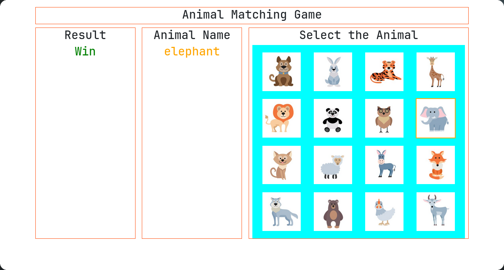
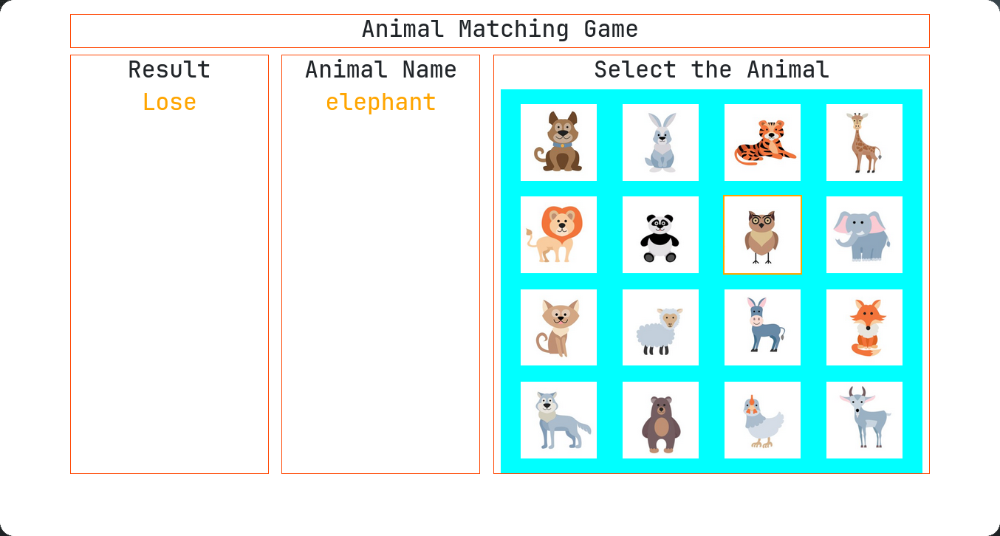

# IT3133-Assignment-4
# 2020/ICT/19

---

# **Animal Matching Game**

## **Project Overview**
The **Animal Matching Game** is an interactive React application designed to help players, especially children, recognize animals and improve their visual recognition skills. The game randomly displays an animal's name, and the player must click the corresponding image from a grid of options.

The application utilizes **React**, **React-Bootstrap**, and custom logic to provide a dynamic and engaging experience.

---

## **ScreenShots**



---

## **Features**
- Displays a random animal name for each round.
- A grid of 16 animal images dynamically rendered.
- Visual feedback for hover effects on images.
- Real-time result evaluation (Win or Lose) based on the player's selection.
- Simple, responsive layout styled using React-Bootstrap.

---

## **Technologies Used**
- **React**: Frontend library for building the UI.
- **React-Bootstrap**: For responsive design and styling.
- **JavaScript**: For application logic and interactivity.
- **CSS**: For custom styles and hover effects.

---

## **Setup Instructions**

### Prerequisites
Ensure the following are installed:
- Node.js (v16+ recommended)
- npm or yarn

### Steps
1. **Clone the Repository**:
   ```bash
   git clone https://github.com/5yndr0m/simple-react-game.git
   cd simple-react-game
   ```

2. **Install Dependencies**:
   ```bash
   npm install
   ```

3. **Run the Application**:
   ```bash
   npm start
   ```
   This will start the development server. Open [http://localhost:3000](http://localhost:3000) in your browser.

4. **Project Structure**:
   - **`src/components/`**: Contains the reusable components:
     - `AnimalImages.js`: Displays animal images in a grid.
     - `ResultView.js`: Shows the game result ("Win" or "Lose").
     - `RandomNamePicker.js`: Displays the randomly picked animal name.
   - **`src/assets/AnimalsDb.js`**: Provides the animal data (name and image path).
   - **`public/fig/`**: Store all animal images here.

---

## **How to Play**
1. The game starts by displaying the name of a random animal.
2. A grid of 16 animal images appears below the name.
3. Hover over an image to highlight it.
4. Click the image that matches the displayed name.
5. The result is shown instantly as either "Win" (correct choice) or "Lose" (incorrect choice).

---

## **Folder Structure**
```plaintext
project/
│
├── public/
│   └── fig/
│       └── <animal images>  # Store your animal images here
├── src/
│   ├── assets/
│   │   └── AnimalsDb.js     # Animal data (name and image path)
│   ├── components/
│   │   ├── AnimalImages.js  # Animal grid component
│   │   ├── ResultView.js    # Result display component
│   │   └── RandomNamePicker.js  # Random animal name picker
│   ├── App.js               # Main application logic
│   ├── App.css              # Custom styles
│   └── index.js             # React entry point
└── package.json             # Dependencies and scripts
```

---

## **Customization**
1. **Animal Database**:
   Update `AnimalsDb.js` to add or modify animal data:
   ```javascript
   const animals = [
       { name: "Lion", img: "lion.jpg" },
       { name: "Elephant", img: "elephant.jpg" },
       ...
   ];
   export default animals;
   ```

2. **Styling**:
   Modify `App.css` or component-specific styles for custom layouts and themes.

---

## **License**
This project is licensed under the MIT License.

---
